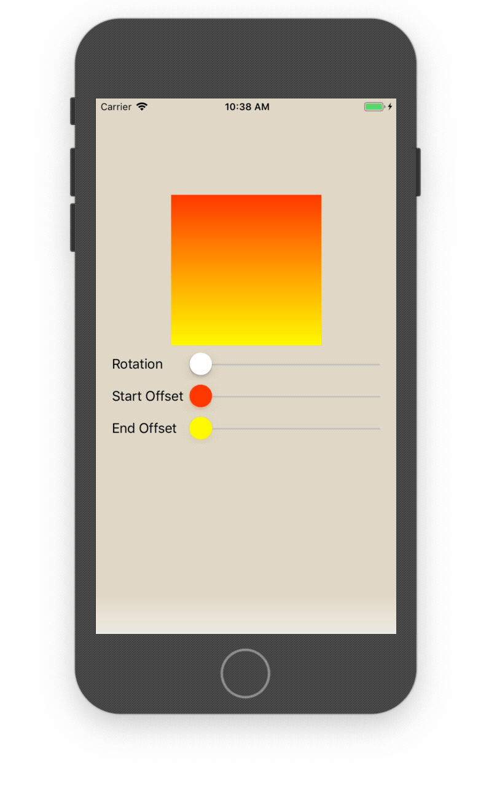
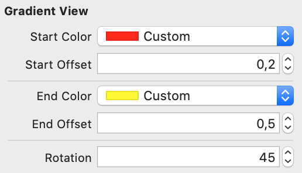

# LDOGradientView

[](https://cocoapods.org/pods/LDOGradientView)
[](https://cocoapods.org/pods/LDOGradientView)
[](https://cocoapods.org/pods/LDOGradientView)




## Usage

```swift
let gradientView = LDOGradientView()
gradientView.rotation = CGFloat(45)
gradientView.startColor = .red
gradientView.endColor = .yellow
gradientView.startOffset = 0.2
gradientView.endOffset = 0.2
```

While easy to use from code, you'll probably want to configure it in Interface Builder.




## Example

To run the example project, clone the repo, and run `pod install` from the Example directory first.

## Installation

LDOGradientView is available through [CocoaPods](https://cocoapods.org). To install
it, simply add the following line to your Podfile:

```ruby
pod 'LDOGradientView'
```

## Author

Raschke & Ludwig GbR, https://www.lurado.com/

## License

LDOGradientView is available under the MIT license.
See the [LICENSE](LICENSE) file for more information.
